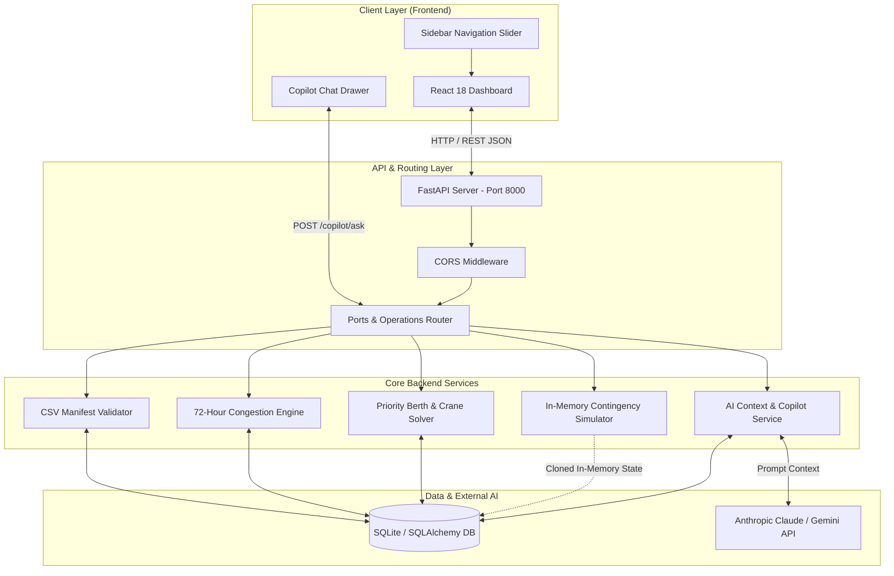

# Architecture

## System Architecture

PORTAI is organized into a modular decoupled architecture comprising a high-performance **FastAPI backend engine** and a **React 18 + TypeScript frontend** designed as a maritime operations command center.

## Component Breakdown

| Layer | Component / File | Technology | Responsibility |
|---|---|---|---|
| **Frontend** | `SidebarNav.tsx` | React, Tailwind | Collapsible side navigation slider with live telemetry badges and responsive mobile drawer |
| **Frontend** | `OverviewPage.tsx` | React, Sono Fonts | Central Command Center: KPI telemetry strip, dominant hero risk panel, 72H forecast timeline |
| **Frontend** | `VesselsPage.tsx` | React, TypeScript | AIS Live Fleet tracking table, search, cargo priority filters, carrier inspection drawer |
| **Frontend** | `TerminalsPage.tsx` | React | Terminal sector infrastructure hub (T1, T2, T3), berth allocation board, STS crane status |
| **Frontend** | `DispatchPage.tsx` | React | Solver impact analysis, dwell reduction progress bars, tactical dispatch order action plan |
| **Frontend** | `SimulationPage.tsx` | React | What-If scenario simulator testing berth/crane offline stress without modifying database |
| **Frontend** | `ReportsPage.tsx` | React | Printable/Exportable 72-hour executive shift audit, risk exposures, demurrage analysis |
| **Frontend** | `CopilotChat.tsx` | React, WebSockets/REST | Floating AI copilot drawer with live stream responses and quick prompt chips |
| **Backend API** | `app/main.py` | FastAPI, Uvicorn | Application initialization, CORS policies, table auto-creation, health check endpoint |
| **Backend API** | `app/routers/ports.py` | FastAPI Router | REST endpoints for upload, reseed, congestion scoring, optimization, simulation, copilot |
| **Service** | `congestion_engine.py` | Python, NumPy | Mathematical 0–100 congestion index calculator across rolling time windows (NOW, 24H, 48H, 72H) |
| **Service** | `optimizer.py` | Python | Priority-aware berth matching, STS crane allocation, and alternate terminal diversion heuristic |
| **Service** | `simulate.py` | Python | Non-destructive in-memory contingency simulator for berth closures and crane outages |
| **Service** | `ai_copilot.py` | Python, Anthropic/Gemini | Grounded prompt assembly, root cause explanation, and structured report generator |
| **Data Layer** | `app/models.py` | SQLAlchemy 2.0, SQLite | Relational schema modeling Port, Berth, Crane, and Vessel arrival records |

## Data Flow

1. **Schedule Ingestion**:
   - The user uploads a maritime schedule CSV file via the UI or REST endpoint `POST /ports/{port_id}/vessels/upload`.
   - The validator parses and checks required fields (`Vessel ID`, `ETA`, `ETD`, `Containers`, `Size`, `Priority`, `Terminal`).
   - Old vessel records are cleared, and new records are inserted into the database.
2. **Congestion Scoring & Forecasting**:
   - The frontend calls `GET /ports/{port_id}/congestion`.
   - The engine partitions schedule windows (`NOW`, `24H`, `48H`, `72H`), calculating vessel density, berth utilization %, crane utilization %, and queue pressure to generate a normalized 0–100 Congestion Index.
3. **Dispatch Optimization**:
   - `GET /ports/{port_id}/optimize` triggers the solver.
   - High/Urgent priority vessels are matched to suitable deep-water berths; heavy-TEU ships receive dedicated multi-crane gangs; overloaded terminal vessels are diverted to open terminals.
4. **Contingency Simulation**:
   - `POST /ports/{port_id}/simulate` takes an asset ID and failure mode.
   - An in-memory clone of the schedule is modified (marking the asset offline), re-optimized, and compared against the baseline.
5. **Copilot Interaction**:
   - `POST /ports/{port_id}/copilot/ask` compiles live database context and sends it to the LLM (or deterministic fallback) for grounded, hallucination-free answers.

## Security Considerations

- **Environment Isolation**: Sensitive credentials (e.g. `ANTHROPIC_API_KEY`, `GEMINI_API_KEY`) are stored in `.env` and accessed exclusively via `os.getenv`.
- **CORS Protection**: CORS middleware explicitly restricts origins to authorized frontend development ports (`http://localhost:3000`, `http://127.0.0.1:3000`).
- **Input Validation**: Strict Pydantic models validate all incoming request bodies and query parameters, rejecting malformed datetimes and enum values.

## Scalability Notes

- **Database Migration**: The SQLite database can be swapped for PostgreSQL or IBM Cloud Databases for PostgreSQL by updating `DATABASE_URL` in `database.py`.
- **Stateless Backend**: The FastAPI backend is entirely stateless, allowing horizontal scaling across multiple container instances (e.g., Kubernetes / OpenShift) behind a load balancer.
