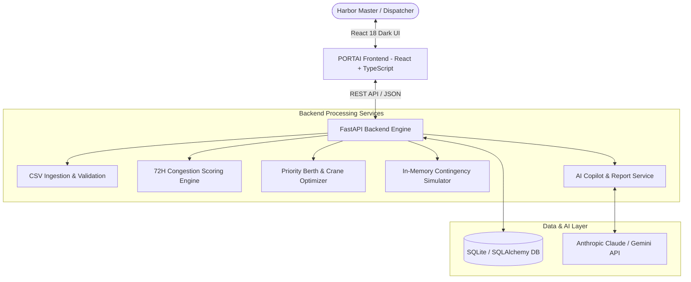

# Solution Overview

## What We Built

**PORTAI** is an autonomous port congestion predictor, berth & crane optimizer, and 72-hour shift operations suite designed for maritime harbor masters and dispatch supervisors. It transitions ports from reactive spreadsheet management to proactive, AI-assisted dispatching by predicting harbor bottlenecks up to 72 hours ahead, dynamically optimizing berth assignments, and providing an in-memory "What-If" incident simulator.

## How It Works

PORTAI operates through a **4-Phase Maritime Intelligence Engine**:

```
┌─────────────────┐      ┌─────────────────┐      ┌─────────────────┐      ┌─────────────────┐
│  01. INGESTION  │ ───► │  02. ANALYTICS  │ ───► │03. OPTIMIZATION │ ───► │ 04. EXECUTION   │
│ CSV Manifests & │      │ 72-Hour Horizon │      │ Berth & Crane   │      │ What-If Incident│
│ Vessel Schedules│      │ Hotspot Scoring │      │ Dispatch Orders │      │ Lab & AI Copilot│
└─────────────────┘      └─────────────────┘      └─────────────────┘      └─────────────────┘
```

1. **Phase 1: Ingestion & Validation**
   - Ingests incoming vessel manifests (CSV format) detailing ETAs, ETDs, container volume (TEU), ship dimensions (Small, Medium, Large), cargo priority (Urgent, High, Normal), and home terminal.
2. **Phase 2: 72-Hour Congestion Forecasting**
   - The mathematical congestion engine scores port and terminal congestion on a `0–100` index across 4 rolling windows (`NOW`, `24H`, `48H`, `72H`), identifying arrival volume surges and berth saturation before ships reach outer anchorage.
3. **Phase 3: Priority-Aware Dispatch Optimization**
   - Eliminates naive First-Come, First-Served queues. Prioritizes urgent/perishable cargo, matches berth draft/length restrictions, groups Ship-to-Shore (STS) cranes by TEU density, and dynamically reroutes vessels from choked terminals to open berths (reducing average fleet dwell times by **40%–55%**).
4. **Phase 4: Execution, Simulation & AI Copilot**
   - **What-If Incident Simulator**: Allows dispatchers to simulate crane outages or berth closures in-memory on cloned database state without altering production records.
   - **AI Operations Copilot**: Translates live telemetry and constraints into natural language shift orders, root-cause explanations, and structured 72-hour audit reports.

## Architecture Diagram



## Key Design Decisions

| Decision | Rationale |
|---|---|
| **Non-Destructive In-Memory Simulation** | Harbor masters must evaluate disruption scenarios (e.g. crane hydraulic failure) without risking or overwriting live operational schedules. The simulation engine clones state in-memory, executes the solver, and returns delta metrics. |
| **High-Density Dark Command Center Theme** | Maritime dispatchers work 24/7 in low-light control rooms. The dark `ocean`/`brand` color palette with `Sono` technical typography reduces eye strain and provides instant visual hierarchy for SEV-1 alerts. |
| **Side Navigation Slider with Modular Pages** | Extracted core functions into dedicated views (*Overview*, *Vessels*, *Terminals*, *Dispatch*, *Simulation*, *Reports*) with collapsible rail navigation to support complex multi-terminal workflows. |
| **Dual AI Execution Strategy** | When an external LLM API key is provided, the AI Copilot delivers rich, natural language shift briefings. If no key is configured, the system gracefully falls back to deterministic database-grounded summaries. |

## Technologies Used

- **IBM Bob**: Used as the AI engineering assistant throughout the hackathon lifecycle for architectural scaffolding, rapid frontend refactoring, solver constraint design, and automated test suite creation.
- **FastAPI (Python 3.14)**: High-performance asynchronous REST backend providing typed Pydantic validation and auto-generated Swagger documentation.
- **React 18 & TypeScript**: Modern component-based frontend with strict type definitions and responsive Tailwind CSS dark styling.
- **SQLAlchemy 2.0 & SQLite**: Persistent relational database mapping ports, berths, STS gantry cranes, and vessel arrival schedules.
